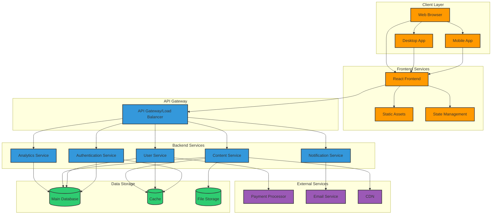

# System Architecture Overview

This document outlines the architecture of our application, showing how different components interact and data flows through the system.

## Architecture Diagram



## Component Description

### Client Layer
- **Web Browser**: Users access the application through web browsers
- **Mobile App**: Native mobile application for iOS and Android
- **Desktop App**: Electron-based desktop application

### Frontend Services
- **React Frontend**: Single-page application built with React
- **Static Assets**: Images, CSS, and client-side JavaScript
- **State Management**: Redux/Context for application state

### API Gateway
- **API Gateway/Load Balancer**: Routes requests to appropriate microservices and handles load balancing

### Backend Services
- **Authentication Service**: Handles user authentication and authorization
- **User Service**: Manages user profiles and preferences
- **Content Service**: Handles content creation, retrieval, and management
- **Analytics Service**: Collects and processes user activity data
- **Notification Service**: Manages user notifications via various channels

### Data Storage
- **Main Database**: PostgreSQL for persistent storage
- **Cache**: Redis for improved performance and session storage
- **File Storage**: S3-compatible object storage for files and media

### External Services
- **Payment Processor**: Third-party payment processing service
- **Email Service**: Email delivery service
- **CDN**: Content Delivery Network for static assets and media

## Data Flow

1. Users interact with the application through one of the client interfaces
2. Frontend services manage UI rendering and local state
3. API requests are routed through the API Gateway to appropriate backend services
4. Backend services process requests, interact with databases, and call external services as needed
5. Responses flow back to the client through the same path

## Scalability Considerations

- Horizontally scalable microservices
- Caching layer for improved performance
- CDN for global content delivery
- Load balancing for high availability
```